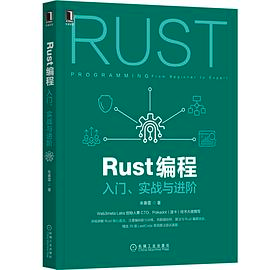
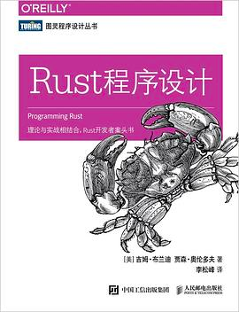
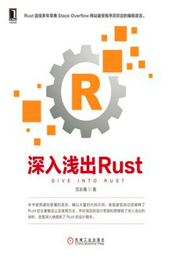
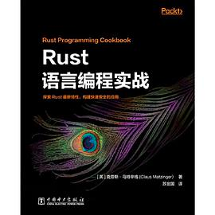

# 💖 Rust 图书推荐

## 入门:

> Rust编程：入门、实战与进阶

- https://book.douban.com/subject/35447165/
- ⭐⭐⭐
- 比较简洁, 快速熟悉 rust 语法.

> Rust程序设计

- https://book.douban.com/subject/35217097/
- ⭐⭐
- rust 官方教程. 此书很厚, 是手册型.
- 虽然很多人都推荐, 但是, 我并不推荐.(我只给2星)
- 很多人, 反复入门 rust(三过其门,而不入). 大概很大程度都是被此书劝退.
- 我不建议作为第一本, 这种手册, 只适合翻查(类似字典). 不适合通读.(可以, 但没必要)
- 建议只在对 rust 高阶语法理解不清楚的地方, 查查对应章节即可. (跳读)

## 进阶:

> 深入浅出Rust

- https://book.douban.com/subject/30312231/
- ⭐⭐⭐⭐⭐
- 必读.
- 对 Rust 复杂语法点解释非常到位, 大量和 C++ 对比, 体会 Rust 的改进点.

> Rust语言编程实战

- [Rust语言编程实战 - Douban](https://book.douban.com/subject/35317257/)
- [Rust语言编程实战 - JD](https://item.jd.com/10027041615889.html)
- ⭐⭐⭐⭐⭐
- 必读.
- 大量示例, 学习 rust 编程技巧.
